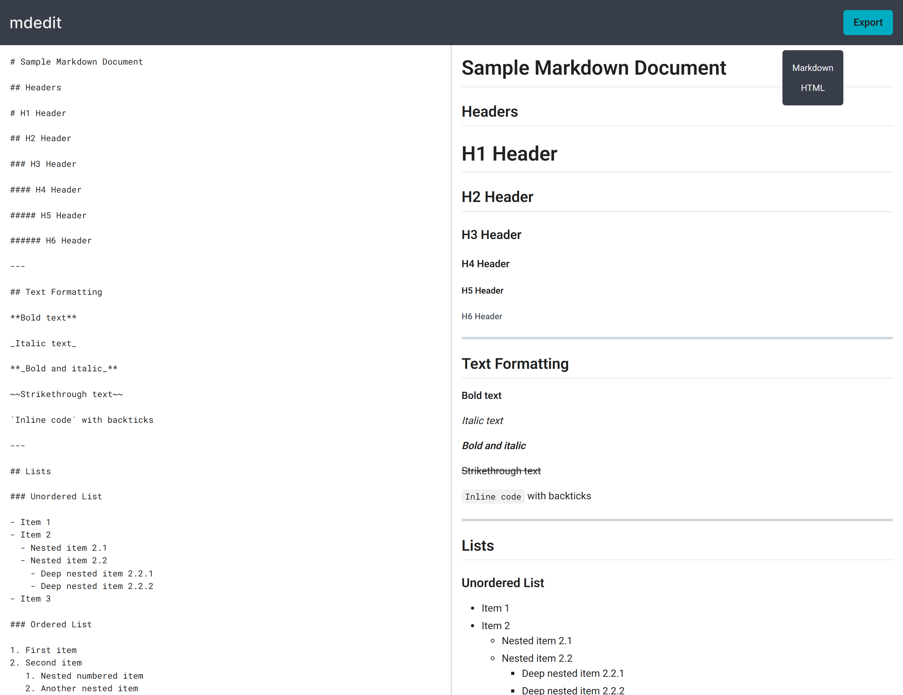

# MdEdit

A minimal markdown live editor.



## Live Demo

View the live demo [here](https://md-editt.netlify.app).

## Features

- Live preview while editing
- Export as Markdown or HTML
- Secure Markdown rendering

## Getting Started

### Prerequisites

- Node.js
- Npm or Yarn

### Setup

```bash
# Clone the repository
git clone https://github.com/wassim-itani/md-edit.git

# Navigate to project directory
cd md-edit

# Install dependencies
npm install
# or
yarn install

# Start development server
npm run dev
# or
yarn dev
```

## Tech Stack

- React
- CSS3
- Vite
- Marked (Markdown parser & compiler)
- DOMPurify (HTML sanitizer)
